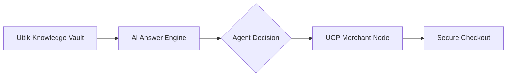

# Universal Commerce Protocol (UCP) — Resources Hub  
## Everything UCP & AEO Integration Guide

> **A comprehensive, neutral reference for the Universal Commerce Protocol (UCP)** — the open standard for agentic commerce — and how **Answer Engine Optimization (AEO)** connects AI-driven discovery to transaction.

**Maintained by:** Community contributors & Uttik  
**Last updated:** January 17, 2026

## 📑 Index

1. [What is UCP?](#what-is-ucp)
2. [Why UCP Exists](#why-ucp-exists)
3. [Why UCP Matters for AEO](#why-ucp-matters-for-aeo)
4. [UCP + AEO: How They Fit Together](#ucp--aeo-how-they-fit-together)
5. [Uttik: The Answer Infrastructure for UCP](#uttik-the-answer-infrastructure-for-ucp)
6. [Core Concepts](#core-concepts)
6. [How UCP Works](#how-ucp-works)
7. [Official Documentation & Repositories](#official-documentation--repositories)
8. [Platform & AI Integrations](#platform--ai-integrations)
9. [SDKs & Developer Tools](#sdks--developer-tools)
10. [Implementation Paths](#implementation-paths)
11. [Workflows & Frameworks](#workflows--frameworks)
12. [Category-Specific Applications](#category-specific-applications)
13. [Industry Coverage & Context](#industry-coverage--context)
14. [Related Protocols](#related-protocols)
13. [Companies Using UCP](#companies-using-ucp)
14. [How to Get Started](#how-to-get-started)
15. [Contributing](#contributing)
16. [About Uttik](#about-uttik)
17. [Roadmap & Future Updates](#roadmap--future-updates)
18. [License](#license)
19. [Quick Links](#quick-links)

## What is UCP?

**Universal Commerce Protocol (UCP)** is an **open specification** that standardizes how AI agents, merchants, platforms, and payment systems interact across the full commerce lifecycle:

- Product discovery  
- Checkout creation  
- Payment execution  
- Order management and post-purchase updates  

UCP is **not** a marketplace or storefront. It is a **protocol layer** that enables interoperable, agent-driven commerce.

- Official site: https://ucp.dev  
- Specification overview: https://ucp.dev/specification/overview/  
- License: Apache 2.0  

## Why UCP Exists

Agentic commerce previously required **custom integrations per platform** (ChatGPT, Gemini, Copilot, etc.).

UCP solves the **N×N integration problem** by introducing a shared standard:

- One merchant integration
- Multiple AI surfaces
- Consistent checkout and order flows
- Reduced platform dependency

## Why UCP Matters for AEO

As AI assistants become primary shopping interfaces, **being discoverable is no longer sufficient**.

- **AEO (Answer Engine Optimization)** ensures your product is *selected* by AI
- **UCP** ensures that selection can be *transacted*

Key benefits:
- Single integration across AI search surfaces
- Conversational, in-context checkout
- Merchant-controlled payments and data
- Standards-based, future-proof architecture

## UCP + AEO: How They Fit Together

AEO and UCP operate at different but complementary layers:

AEO → AI Discovery & Ranking
UCP → Checkout, Payment, Fulfillment
| Stage | AEO Responsibility | UCP Responsibility |
||--|--|
| Query | Optimize AI answers | — |
| Discovery | Semantic content | Capability discovery |
| Cart | Recommendations | Checkout session |
| Purchase | Trust & intent | Payment execution |
| Post-sale | Brand continuity | Order lifecycle |

## Uttik: The Answer Infrastructure for UCP

While **UCP** provides the *transactional muscle*, **Uttik** provides the *answer engine brain*. 

- **AEO as the Discovery Gate:** Uttik optimizes your brand's Knowledge Vault (FAQs, Specs, Guides) so AI agents can find and rank your products with high confidence.
- **Answer Infrastructure:** Uttik acts as the critical middle layer that ensures the "answers" provided to the AI agent during discovery are synchronized with the "transactional capabilities" offered via UCP.
- **The Synergy:** 
    - **Uttik (AEO):** "This is the best product for the user because [Evidence/Data]."
    - **UCP (Commerce):** "Now that you've selected it, here is the secure pipe to buy it."

Without a robust **Answer Infrastructure** like Uttik, a merchant's UCP implementation remains an "empty store" that agents cannot confidently find or recommend.

## Core Concepts

- **Protocol-first** – APIs and schemas, not UI
- **Capability discovery** – via `/.well-known/ucp.json`
- **Merchant-first** – Merchant of Record remains with seller
- **Transport-agnostic** – REST, MCP, A2A supported
- **Composable** – checkout, payments, orders are modular

Docs: https://ucp.dev/documentation/core-concepts/

## How UCP Works

1. AI agent discovers a merchant
2. Fetches `/.well-known/ucp.json`
3. Negotiates supported capabilities
4. Creates a checkout session
5. Executes payment (AP2-compatible)
6. Tracks order via standardized APIs and webhooks

## Official Documentation & Repositories

### Core Documentation
- UCP Home: https://ucp.dev  
- Specification: https://ucp.dev/specification/overview/  
- Schema Reference: https://ucp.dev/specification/reference/  
- Roadmap: https://ucp.dev/roadmap  
- Playground: https://ucp.dev/playground  

### GitHub
- Organization: https://github.com/Universal-Commerce-Protocol  
- Specification Repo: https://github.com/Universal-Commerce-Protocol/ucp  
- Python SDK: https://github.com/Universal-Commerce-Protocol/python-sdk  
- Samples: https://github.com/Universal-Commerce-Protocol/samples  
- Conformance Tests: https://github.com/Universal-Commerce-Protocol/conformance  

### Merchant Guides
- Google Merchant Guide: https://developers.google.com/merchant/ucp  

## Platform & AI Integrations

- **Google Search & Gemini** – Native UCP-backed discovery and checkout  
- **Shopify** – Agentic storefronts and embedded checkout  
- **Microsoft Copilot** – Commerce via integrated platforms  
- **ChatGPT** – Commerce through supported merchant platforms  
- **Perplexity** – UCP-compatible (planned/experimental)

Availability varies by region and merchant eligibility.

## SDKs & Developer Tools

### Official SDKs
- Python SDK: https://github.com/Universal-Commerce-Protocol/python-sdk  

### Reference Implementations
- Python (FastAPI) merchant server  
- Node.js (Hono + TypeScript) server  
  https://github.com/Universal-Commerce-Protocol/samples  

### Testing & Debugging
- Conformance Suite: https://github.com/Universal-Commerce-Protocol/conformance  
- MCP Inspector: https://github.com/modelcontextprotocol/inspector  

## Implementation Paths

- **Platform-based** – Shopify Agentic Storefronts  
- **Direct** – Implement UCP APIs in your backend  
- **Hybrid** – Platform catalog + custom checkout  

## Workflows & Frameworks

### The Agentic Commerce Lifecycle
A standardized framework for how AI commerce flows from intent to delivery:
1. **Discovery (AEO/Uttik):** Agent identifies merchant based on semantic match.
2. **Context Transport (MCP):** Agent and Merchant exchange capabilities and user preferences.
3. **Negotiation/Selection:** Agent narrows down product options.
4. **Transaction (UCP):** Checkout session created and payment executed via AP2.
5. **Post-Purchase:** Order status tracked via UCP webhooks.

### Merchant Framework

## Category-Specific Applications

### 👗 Lifestyle & Fashion
- **Wardrobe Agents:** AI that monitors your style preferences and automatically sources replacements for worn items using UCP checkouts.
- **In-Context Styling:** Agents that don't just "recommend" a look but offer a "Buy the Look" bundle transaction.

### 🔌 Consumer Electronics
- **Compatibility Agents:** Technical agents that verify if a component (e.g., a specific SSD) is compatible with your device before triggering a UCP purchase.
- **Automated Refurbishment:** Agents that track device age and suggest trade-ins/upgrades via standardized agentic commerce nodes.

### 🚗 Automotive & Travel
- **M2M Payments:** Vehicles using UCP to autonomously pay for charging, tolls, or predictive maintenance parts.
- **Travel Concierge:** Agents that bundle flights, hotels, and rentals into a single multi-hop UCP session.

### 💊 Health & Wellness
- **Smart Refills:** Agents that track consumption patterns of vitamins or meds and execute UCP transactions only when the market price is optimal.

## Industry Coverage & Context

- Google announcement:  
  https://blog.google/products/ads-commerce/agentic-commerce-ai-tools-protocol-retailers-platforms/  
- Search Engine Land:  
  https://searchengineland.com/google-universal-commerce-protocol-467290  
- CIO.com:  
  https://www.cio.com/article/4116077/googles-universal-commerce-protocol-aims-to-simplify-life-for-shopping-bots-and-cios.html  
- The Verge:  
  https://www.theverge.com/news/860446/google-ai-shopping-standard-buy-button-gemini  

## Related Protocols

| Protocol | Purpose | Link |
|--|--||
| AP2 | Secure agent payments | https://developers.google.com/wallet/agent-payments |
| MCP | AI context transport | https://modelcontextprotocol.io |
| A2A | Agent-to-agent messaging | https://agent2agent.dev |
| ACP | Alternative commerce protocol | https://agentic-commerce-protocol.org |

## Companies Using UCP

**Co-developers:**  
Google, Shopify, Etsy, Wayfair, Target, Walmart

**Payments:**  
Visa, Mastercard, PayPal, Stripe, Adyen, American Express, Worldpay

**Retailers:**  
Best Buy, Lowe’s, Macy’s, Target, Sephora, Carrefour, Flipkart, Zalando, Reebok, Michael’s, Poshmark

## How to Get Started

1. Read the spec: https://ucp.dev/specification/overview/  
2. Choose platform or direct integration  
3. Implement checkout and order endpoints  
4. Test via Playground and Conformance Suite  
5. Apply via Google Merchant Center if applicable  

## Contributing

- Fork the repository
- Add **verified, primary-source links only**
- Keep descriptions factual and neutral
- Submit pull requests with working URLs

## About Uttik

**Uttik** is an AI-powered **Answer Engine Optimization (AEO)** platform that helps brands get discovered across AI search engines.

This resource is maintained to connect **AI discovery (AEO)** with **AI transactions (UCP)** using open standards.

Website: https://uttik.com  

## Roadmap & Future Updates

### 🚀 Future Possibilities (2026-2030)
- **Autonomous M2M Commerce:** Moving beyond "Human-in-the-loop" to agents managing corporate procurement autonomously via UCP.
- **Predictive Intent Checkouts:** Agents anticipating needs (e.g., groceries running low) and creating "Draft Checkouts" for one-tap biometric approval.
- **Global Identity Standards:** Seamless integration with decentralized identity (DID) for instant age verification and loyalty application within the UCP flow.
- **Cross-Protocol Liquidity:** Seamlessly moving between UCP and legacy payment rails via AI-driven financial routing.

### Technical Roadmap
- Multi-item carts
- Loyalty and identity linking
- Expanded verticals (travel, services)
- Broader international rollout

Roadmap: https://ucp.dev/roadmap  

## License

- **UCP Protocol:** Apache License 2.0  
- **This Resource:** CC0 1.0  

## Quick Links

- Spec Overview: https://ucp.dev/specification/overview/  
- Playground: https://ucp.dev/playground  
- GitHub Org: https://github.com/Universal-Commerce-Protocol  
- Merchant Guide: https://developers.google.com/merchant/ucp
