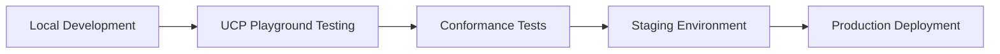

# UCP Resources Hub by Uttik

> **Your Complete Guide to Universal Commerce Protocol & AI-Powered Shopping Discovery**

[](https://uttik.com)
[](https://ucp.dev)
[](https://github.com/yourusername/ucp-resources-hub)

A comprehensive, curated collection of Universal Commerce Protocol (UCP) resources, tools, and implementation guides — brought to you by **[Uttik](https://uttik.com)**, the AI-powered Answer Engine Optimization platform.

---

## 🎯 Why This Matters for AEO

**Universal Commerce Protocol is revolutionizing how products are discovered and purchased in AI search engines.** As AI assistants like ChatGPT, Google Gemini, Perplexity, and Claude become primary shopping interfaces, UCP provides the infrastructure that makes your products discoverable and purchasable across all these platforms.

**For businesses optimizing for Answer Engine Optimization (AEO):**
- ✅ **Single Integration, Multiple AI Surfaces**: Implement UCP once, appear everywhere
- ✅ **Conversational Commerce Ready**: Your products become AI-agent compatible
- ✅ **Enhanced Discovery**: Better visibility in AI Mode, Gemini, and ChatGPT
- ✅ **Direct Transactions**: Complete checkout without leaving AI conversations
- ✅ **Future-Proof**: Built on open standards for the next generation of search

---

## 📋 Table of Contents

* [What is UCP?](#what-is-ucp)
* [Why UCP Matters for Your Business](#why-ucp-matters-for-your-business)
* [UCP & Answer Engine Optimization](#ucp--answer-engine-optimization)
* [Official Resources](#official-resources)
* [Latest Announcements](#latest-announcements)
* [Implementation Guides](#implementation-guides)
* [SDKs & Developer Tools](#sdks--developer-tools)
* [Platform Integrations](#platform-integrations)
* [Learning Resources](#learning-resources)
* [Industry News & Analysis](#industry-news--analysis)
* [Related Protocols](#related-protocols)
* [Companies Using UCP](#companies-using-ucp)
* [How to Get Started](#how-to-get-started)
* [Contributing](#contributing)
* [About Uttik](#about-uttik)

---

## 🚀 What is UCP?

**Universal Commerce Protocol (UCP)** is an open-source protocol that enables seamless commerce across AI agents and platforms. Think of it as the "HTTP for AI shopping" — it defines standard building blocks for:

- 🔍 **Product Discovery**: How AI agents find your products
- 🛒 **Cart & Checkout**: Completing purchases within AI conversations
- 📦 **Order Management**: Post-purchase tracking and support
- 💳 **Secure Payments**: Cryptographically verified transactions

### Key Features

| Feature | Benefit |
|---------|---------|
| **Transport Agnostic** | Works via REST APIs, MCP, A2A protocols |
| **Merchant-First** | You remain Merchant of Record with full data ownership |
| **Payment Flexible** | Compatible with Google Pay, PayPal, Stripe, and more |
| **Open & Extensible** | Community-driven, Apache 2.0 licensed |
| **Production Ready** | Launched January 2025 with 20+ major partners |

### Architecture Overview

```
AI Surface (ChatGPT, Gemini, etc.)
           ↓
    [UCP Protocol Layer]
           ↓
  Merchant Backend (Your Store)
           ↓
    Payment Processor
```

**Launched:** January 11-12, 2025 at National Retail Federation (NRF) Conference  
**Co-Developers:** Google, Shopify, Etsy, Wayfair, Target, Walmart  
**Endorsers:** 20+ companies including Visa, Mastercard, PayPal, Stripe

---

## 💡 Why UCP Matters for Your Business

### The Shift to Agentic Commerce

Traditional e-commerce: `User searches → Clicks link → Browses site → Adds to cart → Checkout`

Agentic commerce: `User asks AI → AI discovers → AI presents → AI completes purchase`

**According to Salesforce:** AI and agents drove ~20% of retail sales ($272B globally) during 2025 holiday season.

### The Integration Problem UCP Solves

**Without UCP:**
- ❌ Build custom integration for ChatGPT
- ❌ Build another for Google Gemini  
- ❌ Build another for Microsoft Copilot
- ❌ Build another for Claude
- ❌ N × N integration complexity

**With UCP:**
- ✅ Single protocol implementation
- ✅ Works across all UCP-enabled AI platforms
- ✅ Standardized discovery, checkout, and fulfillment
- ✅ Future platforms automatically compatible

### Business Benefits

| Benefit | Impact |
|---------|--------|
| **Expanded Reach** | Access high-intent shoppers in AI Mode, Gemini, ChatGPT |
| **Reduced Cart Abandonment** | Frictionless checkout within conversations |
| **Lower Integration Costs** | One implementation vs. multiple custom builds |
| **Customer Data Ownership** | Remain Merchant of Record, keep all customer relationships |
| **Dynamic Personalization** | Real-time pricing, loyalty, and offers in AI context |

---

## 🎯 UCP & Answer Engine Optimization

### How UCP Enhances AEO Strategy

**[Uttik](https://uttik.com) specializes in Answer Engine Optimization** — helping businesses get discovered by AI search engines like ChatGPT, Google AI Overview, and Perplexity. UCP is the **commerce layer** that complements AEO discovery.

#### The Complete AEO + UCP Strategy

```
1. AEO DISCOVERY ([Uttik's](https://uttik.com) Focus)
   ↓
   Optimize content for AI engines
   Structured data & semantic markup
   Conversational query optimization
   ↓
2. UCP TRANSACTION (UCP's Focus)
   ↓
   Standardized product discovery
   AI-native checkout flows
   Secure payment processing
   ↓
3. CONVERSION
   ↓
   Complete purchase in AI conversation
   Post-purchase order management
```

### UCP as AEO Infrastructure

| AEO Need | UCP Solution |
|----------|--------------|
| **Product Discoverability** | Standardized capability discovery |
| **Rich Product Data** | Structured schemas for AI understanding |
| **Real-time Inventory** | Dynamic pricing and availability APIs |
| **Conversational Purchase** | Native checkout in AI conversations |
| **Trust Signals** | Cryptographic payment verification |

### New Google Features Powered by UCP

**Business Agent** (Launched Jan 2025)
- Branded AI assistant on Google Search
- Answers product questions in your brand voice
- Early adopters: Lowe's, Michael's, Poshmark, Reebok

**Direct Offers in AI Mode**
- Present exclusive discounts in AI conversations
- Personalized pricing based on context
- New Google Ads format

**Merchant Center Attributes**
- Dozens of new fields for conversational discovery
- Goes beyond keywords: FAQs, compatible products, alternatives
- Optimized for AI Mode, Gemini, Business Agent

### Measuring UCP Impact on AEO

Track these metrics to measure UCP effectiveness:

- 📊 **AI Surface Impressions**: How often you appear in AI responses
- 🔍 **Product Discovery Rate**: Percentage of queries showing your products
- 💰 **AI-Driven Conversion Rate**: Purchases completed in AI conversations
- 📈 **Cross-Platform Reach**: Same products across ChatGPT, Gemini, etc.
- ⚡ **Time to Purchase**: Reduced friction from discovery to checkout

---

## 📚 Official Resources

### Core Documentation

* 🌐 **[UCP Official Website](https://ucp.dev/)** - Protocol overview and documentation
* 📦 **[GitHub Organization](https://github.com/Universal-Commerce-Protocol)** - All official repositories
* 📖 **[Main Repository](https://github.com/Universal-Commerce-Protocol/ucp)** - Complete specification (1.6k+ ⭐)
* 🎮 **[Interactive Playground](https://ucp.dev/playground)** - Test UCP implementations
* 🗺️ **[Product Roadmap](https://ucp.dev/roadmap)** - Future features and timeline

### Community & Support

* 💬 **[GitHub Discussions](https://github.com/Universal-Commerce-Protocol/ucp/discussions)** - Ask questions, share ideas
* 🐛 **[Issue Tracker](https://github.com/Universal-Commerce-Protocol/ucp/issues)** - Report bugs, request features
* 📧 **[Waitlist](https://developers.google.com/merchant/ucp)** - Early access to UCP integration

---

## 📢 Latest Announcements

### January 2025 - Official Launch

**Announced at NRF 2025 Conference (New York)**

#### New Features & Integrations

✨ **Business Agent**
- Branded AI shopping assistant for retailers
- Deploy directly on Google Search
- Customizable with your brand voice and data
- **Live Now:** Lowe's, Michael's, Poshmark, Reebok

🎯 **Direct Offers**
- New Google Ads format for AI Mode
- Present exclusive discounts to high-intent shoppers
- Personalized offers in conversational context

🤖 **Gemini Enterprise for Customer Experience**
- AI-powered customer service suite
- Integrated shopping and support experiences
- Built on UCP open standards

📊 **Merchant Center Enhancements**
- Dozens of new data attributes
- Optimized for conversational discovery
- Support for FAQs, compatible products, alternatives

🔗 **Platform Integrations**
- **Microsoft Copilot**: Updated embedded checkout
- **PayPal**: Payment option for UCP checkout
- **Shopify**: Central management via Agentic Storefronts

---

## 🛠️ Implementation Guides

### Quick Start Guides

1. **[Google UCP Merchant Guide](https://developers.google.com/merchant/ucp)** ⭐ **Start Here**
   - Complete integration walkthrough
   - Merchant Center setup
   - Native vs. Embedded checkout options

2. **[Shopify Agentic Commerce Guide](https://www.shopify.com/news/ai-commerce-at-scale)**
   - Enable UCP for Shopify stores
   - Manage via Agentic Storefronts
   - Multi-platform deployment (Google, ChatGPT, Copilot)

3. **[Building UCP - Shopify Engineering](https://shopify.engineering/ucp)**
   - Deep technical architecture dive
   - Composable capabilities explained
   - Real-world implementation patterns

### Integration Paths

#### Option 1: Native Integration (Recommended)
**Best for:** Standard checkout flows, fastest implementation

```
Your Store → UCP API → Google AI Mode / Gemini
```

**Steps:**
1. Set up Merchant Center account
2. Implement UCP checkout endpoints
3. Configure product feeds
4. Test with UCP playground
5. Go live on AI surfaces

#### Option 2: Embedded Integration
**Best for:** Complex branding, custom checkout experiences

```
Your Store → UCP iframe → Embedded in AI conversation
```

**Steps:**
1. Build iframe-based checkout
2. Implement UCP protocol
3. Submit for approval (Google review required)
4. Deploy custom experience

#### Option 3: Platform-Based (Shopify, etc.)
**Best for:** Merchants on supported platforms

```
Shopify Store → Native UCP Support → All AI Surfaces
```

**Steps:**
1. Enable in Shopify Admin
2. Configure Agentic Storefronts
3. Automatic deployment to supported channels

---

## 💻 SDKs & Developer Tools

### Official SDKs

#### Python SDK ⭐ Official
**Repository:** [Universal-Commerce-Protocol/python-sdk](https://github.com/Universal-Commerce-Protocol/python-sdk) (42+ ⭐)

**Features:**
- Pydantic models for type safety
- Auto-generated from JSON schemas
- Full UCP specification coverage

**Installation:**
```bash
# Clone the repository
git clone https://github.com/Universal-Commerce-Protocol/python-sdk.git sdk/python
cd sdk/python

# Install with uv
uv sync
```

**Basic Usage:**
```python
from ucp_sdk import Checkout, LineItem

# Create checkout session
checkout = Checkout(
    currency="USD",
    line_items=[
        LineItem(
            id="item_1",
            title="Product Name",
            quantity=1,
            price=2999  # $29.99 in cents
        )
    ]
)
```

### Sample Implementations

#### 1. Python/FastAPI Reference Server ⭐ Official
**Location:** [samples/rest/python/server](https://github.com/Universal-Commerce-Protocol/samples/tree/main/rest/python/server)

**Demonstrates:**
- Capability discovery
- Checkout session management
- Payment processing
- Order lifecycle webhooks

**Run it:**
```bash
cd rest/python/server
pip install -r requirements.txt --break-system-packages
python main.py
```

#### 2. Node.js/Hono Server ⭐ Official
**Location:** [samples/rest/nodejs](https://github.com/Universal-Commerce-Protocol/samples/tree/main/rest/nodejs)

**Demonstrates:**
- TypeScript implementation
- Hono framework integration
- Zod schema validation
- Full UCP compliance

**Run it:**
```bash
cd rest/nodejs
npm install
npm run dev
```

### Testing & Conformance

#### UCP Conformance Tests
**Repository:** [Universal-Commerce-Protocol/conformance](https://github.com/Universal-Commerce-Protocol/conformance)

**Purpose:**
- Validate your UCP implementation
- Ensure protocol compliance
- Test against official specs

**Usage:**
```bash
# Run conformance tests against your server
python conformance_test.py --server http://localhost:8000
```

### Development Tools

#### UCP Inspector (MCP Inspector)
```bash
# Debug your UCP server
npx @modelcontextprotocol/inspector node /path/to/server.js
```

#### Mock Server for Testing
**Repository:** [Upsonic/ucp-mockup-server](https://github.com/Upsonic/ucp-mockup-server)

```bash
# Run local mock UCP server
python mock_server.py
```

---

## 🔌 Platform Integrations

### Google Ecosystem

#### AI Mode in Google Search
- **Status:** Launching soon (U.S. first)
- **Capabilities:** Native checkout, Google Pay, PayPal
- **Requirements:** Active Merchant Center, UCP integration

#### Gemini App
- **Status:** Web launching soon, app following
- **Features:** Conversational shopping, real-time inventory
- **Integration:** Same as AI Mode

#### Business Agent
- **Status:** Live (select retailers)
- **Setup:** Enable in Merchant Center
- **Customization:** Brand voice, training data, custom offers

### Shopify Integration

**Agentic Storefronts** (Central Dashboard)
- Manage all AI channel integrations
- ChatGPT, Google, Microsoft Copilot
- Universal Cart for multi-merchant shopping
- Real-time sync across platforms

**Shopify Catalog**
- Available through Agentic plan
- No Shopify store required
- Product feed for AI surfaces

### Microsoft Copilot

**Copilot Checkout**
- Embedded shopping experience
- Powered by Shopify + UCP
- Available now for Shopify merchants

### ChatGPT (via Shopify)

**Shopping Integration**
- Shopify-powered commerce
- Managed through Agentic Storefronts
- UCP-compatible checkout

---

## 📖 Learning Resources

### Official Blog Posts & Deep Dives

#### Google

1. **[Under the Hood: Universal Commerce Protocol](https://developers.googleblog.com/under-the-hood-universal-commerce-protocol-ucp/)** ⭐ Must Read
   - Published: January 11, 2025
   - Authors: Amit Handa (Director of Engineering), Ashish Gupta (VP/GM Merchant Shopping)
   - Topics: Architecture, capabilities, implementation walkthrough

2. **[New Tech for Retailers - Agentic Shopping Era](https://blog.google/products/ads-commerce/agentic-commerce-ai-tools-protocol-retailers-platforms/)**
   - Complete announcement coverage
   - Business Agent, Direct Offers, Merchant Center updates
   - Strategic vision for agentic commerce

3. **[The AI Platform Shift - Sundar Pichai's NRF Remarks](https://blog.google/company-news/inside-google/message-ceo/nrf-2026-remarks/)**
   - CEO perspective on agentic retail
   - Industry transformation insights

#### Shopify

1. **[Building the Universal Commerce Protocol](https://shopify.engineering/ucp)** ⭐ Technical Deep Dive
   - Engineering perspective
   - Composable architecture explained
   - Capability negotiation patterns
   - Real implementation examples

2. **[The Agentic Commerce Platform](https://www.shopify.com/news/ai-commerce-at-scale)**
   - Announcement from Shopify
   - Multi-platform strategy
   - Integration roadmap

### Industry Analysis & Guides

#### For E-commerce Teams

**[Admetrics: What is Google UCP? Complete Guide for DTC Brands](https://www.admetrics.io/blog/what-is-google-ucp)**
- Practical, marketing-focused overview
- Why DTC brands should care
- Measurement and analytics considerations
- Preparation checklist

**[ALM Corp: Universal Commerce Protocol - Complete 2026 Guide](https://almcorp.com/blog/universal-commerce-protocol-agentic-commerce-guide-2026/)**
- Comprehensive implementation guide
- Statistics and market analysis
- Future predictions
- Technical requirements

#### Partner Announcements

**Payment Providers:**
- [PayPal Supports Trusted AI Checkout](https://newsroom.paypal-corp.com/2025-01-11-From-Search-to-Checkout-PayPal-Supports-Trusted-AI-Checkout-with-Google)
- [Ant International Partnership](https://financialit.net/news/e-commerce/ant-international-partners-google-universal-commerce-protocol-rollout)

**Retailers:**
- [Wayfair Participates in UCP](https://www.pymnts.com/artificial-intelligence-2/2026/wayfair-participates-in-googles-new-standard-for-agentic-commerce/)
- Target's New Shopping Experience
- Etsy Partners with Google on AI Shopping

### Video Content (Coming Soon)

Expected after January 2025 launch:
- Google I/O 2025: UCP Introduction
- UCP Architecture Deep Dive
- Implementation Tutorials

**Monitor:**
- [Google Developers YouTube](https://www.youtube.com/@GoogleDevelopers)
- [ucp.dev](https://ucp.dev) for official announcements

---

## 📰 Industry News & Analysis

### Recent Coverage (January 2025)

**Technology Press:**
- 🔗 [TechCrunch - Google Protocol for AI Commerce](https://techcrunch.com/2026/01/11/google-announces-a-new-protocol-to-facilitate-commerce-using-ai-agents/)
- 🔗 [Search Engine Land - Universal Commerce Protocol Launch](https://searchengineland.com/google-universal-commerce-protocol-467290)
- 🔗 [Computer Weekly - Google Banks on UCP](https://www.computerweekly.com/blog/Open-Source-Insider/Google-banks-on-Universal-Commerce-Protocol-UCP-for-agentic-commerce)
- 🔗 [Heise Online - New Standard for Online Shopping](https://www.heise.de/en/news/Universal-Commerce-Protocol-New-Standard-for-Online-Shopping-11138844.html)

**Financial & Business:**
- 🔗 [American Banker - Google, Shopify Unveil Agentic Protocol](https://www.americanbanker.com/payments/news/google-shopify-unveil-new-agentic-protocol-for-retailers)
- 🔗 [Fintool News - Google Launches UCP](https://fintool.com/news/google-ucp-agentic-commerce-protocol)
- 🔗 [Financial IT - Ant International Partnership](https://financialit.net/news/e-commerce/ant-international-partners-google-universal-commerce-protocol-rollout)

**Marketing & Retail:**
- 🔗 [CIO.com - UCP for Shopping Bots and CIOs](https://www.cio.com/article/4116077/googles-universal-commerce-protocol-aims-to-simplify-life-for-shopping-bots-and-cios.html)
- 🔗 [SEO Roundtable - Agentic Commerce Protocol](https://www.seroundtable.com/google-ai-mode-direct-offers-ads-ucp-40738.html)
- 🔗 [PYMNTS - Wayfair and UCP](https://www.pymnts.com/artificial-intelligence-2/2026/wayfair-participates-in-googles-new-standard-for-agentic-commerce/)

### Key Insights from Coverage

**Market Impact:**
- AI drove ~20% of retail sales ($272B) in 2025 holiday season
- Trillions in commerce volume represented by UCP partners
- Single integration vs. N×N complexity = major cost savings

**Strategic Positioning:**
- Google vs. OpenAI in agentic commerce space
- Shopify as "Switzerland" - partnering with both
- Open standard approach vs. proprietary solutions

**Retailer Concerns:**
- Loss of last touchpoint (cross-sell/upsell opportunity)
- Need to feed product data to AI engines
- Balance between discoverability and margin control

---

## 🔗 Related Protocols

### Compatible Protocols (Built-In Support)

#### Model Context Protocol (MCP)
**Website:** [modelcontextprotocol.io](https://modelcontextprotocol.io/)

**What it is:** Open protocol for AI model interactions  
**UCP Integration:** Built-in MCP transport support  
**Use case:** AI agents communicate with UCP merchants via MCP

```
AI Agent → MCP Transport → UCP Merchant
```

#### Agent Payments Protocol (AP2)
**Website:** [developers.google.com/wallet/agent-payments](https://developers.google.com/wallet/agent-payments)

**What it is:** Secure payment protocol with cryptographic consent  
**UCP Integration:** Fully compatible, recommended for payments  
**Use case:** Verifiable payment credentials with user consent proof

**Key Features:**
- Cryptographic proof of user authorization
- Payment mandate support
- Verifiable credentials
- Open wallet ecosystem

#### Agent2Agent (A2A)
**Website:** [agent2agent.dev](https://agent2agent.dev/)

**What it is:** Protocol for agent-to-agent communication  
**UCP Integration:** Supported transport method  
**Use case:** Direct agent-to-merchant communication

### Alternative Protocols

#### Agent Commerce Protocol (ACP)
**Website:** [agentic-commerce-protocol.org](https://agentic-commerce-protocol.org/)

**Developed by:** OpenAI with Stripe  
**Status:** Competing standard  
**Focus:** Tighter ChatGPT integration, Stripe-centric payments

**UCP vs. ACP:**

| Aspect | UCP | ACP |
|--------|-----|-----|
| **Philosophy** | Broad coalition, vendor-neutral | ChatGPT-first, faster to market |
| **Payments** | Flexible payment handlers | Stripe-centric |
| **Adoption** | 20+ partners across ecosystem | OpenAI/Stripe partnership |
| **Integration** | REST, MCP, A2A support | Optimized for ChatGPT |

**Future:** May interoperate as standards mature. Some retailers may support both protocols.

### Protocol Comparison Table

| Protocol | Purpose | UCP Support | Primary Use |
|----------|---------|-------------|-------------|
| **UCP** | Commerce lifecycle | Native | Shopping & transactions |
| **MCP** | AI model context | Transport | Agent communication |
| **AP2** | Secure payments | Compatible | Payment authorization |
| **A2A** | Agent messaging | Transport | Direct agent interactions |
| **ACP** | Alternative commerce | Potential future | ChatGPT shopping |

---

## 🏢 Companies Using UCP

### Co-Developers (Built UCP Together)

| Company | Role | Contribution |
|---------|------|--------------|
| **[Google](https://google.com)** | Lead Developer | First implementation, AI Mode/Gemini integration |
| **[Shopify](https://shopify.com)** | Co-Developer | Infrastructure, Agentic Storefronts, merchant tools |
| **[Etsy](https://etsy.com)** | Co-Developer | Marketplace perspective, seller tools |
| **[Wayfair](https://wayfair.com)** | Co-Developer | Home goods, complex fulfillment |
| **[Target](https://target.com)** | Co-Developer | Retail operations, omnichannel |
| **[Walmart](https://walmart.com)** | Co-Developer | Scale operations, grocery integration |

### Payment Providers (8)

| Provider | Specialty |
|----------|-----------|
| **[Adyen](https://adyen.com)** | Global payment platform |
| **[American Express](https://americanexpress.com)** | Credit card services |
| **[Ant International](https://antgroup.com)** | Global fintech, Alipay |
| **[Mastercard](https://mastercard.com)** | Payment network |
| **[PayPal](https://paypal.com)** | Digital payments (announced Jan 2025) |
| **[Stripe](https://stripe.com)** | Payment infrastructure |
| **[Visa](https://visa.com)** | Global payments network |
| **[Worldpay](https://worldpay.com)** | Payment processing |

### Retailers & Marketplaces (13+)

**Consumer Electronics:**
- Best Buy

**Fashion & Apparel:**
- Gap
- Zalando (Europe)

**Home & Garden:**
- Lowe's (Business Agent live)
- The Home Depot

**Department Stores:**
- Macy's
- Target

**Beauty & Personal Care:**
- Sephora
- Ulta

**Specialty:**
- Chewy (Pet supplies)
- Michael's (Crafts - Business Agent live)
- Poshmark (Resale - Business Agent live)
- Reebok (Sportswear - Business Agent live)

**Grocery:**
- Carrefour
- Kroger

**International:**
- Flipkart (India)
- Shopee (Southeast Asia)

### Technology Partners

| Partner | Integration |
|---------|-------------|
| **[Microsoft](https://microsoft.com)** | Copilot embedded checkout |
| **[OpenAI](https://openai.com)** | ChatGPT via Shopify |

### Total Ecosystem Stats

- **20+** Official endorsers
- **Trillions** in represented commerce volume
- **6** Co-developers
- **8** Payment providers
- **13+** Major retailers
- **Multiple** AI surfaces supported

---

## 🎯 How to Get Started

### For Merchants

#### Step 1: Assess Your Readiness

**Technical Requirements:**
- ✅ E-commerce backend with API access
- ✅ Product catalog (can use existing feeds)
- ✅ Payment processor integration
- ✅ Development resources (moderate backend skills)

**Business Requirements:**
- ✅ Google Merchant Center account (for Google integration)
- ✅ Products eligible for online checkout
- ✅ Willingness to remain Merchant of Record

#### Step 2: Choose Your Path

**Path A: Platform-Based (Easiest)**
- If you're on Shopify: Enable Agentic Storefronts
- Automatic deployment to Google, ChatGPT, Copilot
- Managed through Shopify Admin

**Path B: Direct Integration (Most Control)**
- Implement UCP endpoints
- Use official SDKs (Python, Node.js)
- Direct connection to AI surfaces

**Path C: Hybrid Approach**
- Use Shopify Catalog (no store required)
- Custom UCP implementation
- Best of both worlds

#### Step 3: Implementation

1. **Set up development environment**
   ```bash
   # Clone Python SDK
   git clone https://github.com/Universal-Commerce-Protocol/python-sdk.git
   
   # Or run sample server
   git clone https://github.com/Universal-Commerce-Protocol/samples.git
   cd samples/rest/python/server
   pip install -r requirements.txt
   python main.py
   ```

2. **Implement core capabilities**
   - Checkout session creation
   - Line item management
   - Payment handling
   - Order webhooks

3. **Test with playground**
   - Visit [ucp.dev/playground](https://ucp.dev/playground)
   - Test your endpoints
   - Validate responses

4. **Join waitlist / Go live**
   - For Google: [Join waitlist](https://developers.google.com/merchant/ucp)
   - Configure Merchant Center
   - Submit for review
   - Launch on AI surfaces

### For Developers

#### Quick Start Tutorial

```python
# 1. Install dependencies
from ucp_sdk import Checkout, LineItem, Payment

# 2. Create checkout session
def create_checkout(items, buyer_email):
    checkout = Checkout(
        currency="USD",
        buyer={"email": buyer_email},
        line_items=[
            LineItem(
                id=item["id"],
                title=item["name"],
                quantity=item["qty"],
                price=item["price_cents"]
            )
            for item in items
        ]
    )
    return checkout

# 3. Handle payment
def complete_checkout(checkout_id, payment_method):
    # Validate payment
    # Process order
    # Return confirmation
    pass

# 4. Send webhooks
def notify_order_update(order_id, status):
    # Send to AI surface
    # Update tracking
    pass
```

#### Development Workflow



### For AEO Practitioners

#### Integrate UCP with Your AEO Strategy

1. **Content Optimization** (Uttik's Core Service)
   - Optimize product descriptions for AI understanding
   - Structure data for conversational queries
   - Implement semantic markup

2. **UCP Implementation** (Commerce Layer)
   - Enable purchasing capability
   - Connect to AI surfaces
   - Complete the conversion funnel

3. **Measurement & Optimization**
   - Track AI surface impressions
   - Monitor conversion rates
   - A/B test product presentations
   - Optimize for different AI personalities

#### Recommended AEO + UCP Stack

```
Content Layer: Uttik AEO Platform
     ↓
Schema & Markup: JSON-LD, Rich Snippets
     ↓
Discovery: AI Search Engines
     ↓
Transaction: UCP Protocol
     ↓
Conversion: Merchant Backend
```

---

## 🤝 Contributing

We welcome contributions from the community! This repository is maintained by **[Uttik](https://uttik.com)** to help businesses navigate the agentic commerce landscape.

### How to Contribute

1. **Fork this repository**
2. **Add resources** in the appropriate section
3. **Follow the format** (links, descriptions, emojis)
4. **Submit a pull request**

### Contribution Guidelines

✅ **Good Contributions:**
- Official documentation links
- Implementation guides and tutorials
- Case studies and success stories
- Tools and utilities
- News articles (with publication dates)
- Video tutorials and walkthroughs

❌ **Avoid:**
- Promotional content without educational value
- Broken or outdated links
- Duplicate resources
- Non-UCP related content

### Resource Format

```markdown
* **[Resource Title](https://link)** - Brief description (50-100 chars)
  * Additional context if needed
  * Multiple bullet points OK
```

---

## 📊 About [Uttik](https://uttik.com)

**[Uttik.com](https://uttik.com)** is an AI-powered Answer Engine Optimization (AEO) platform that helps businesses optimize content for AI search engines like ChatGPT, Google AI Overview, Perplexity, and Claude.

### Why [Uttik](https://uttik.com) Created This Resource

As pioneers in **Answer Engine Optimization**, we recognized that **discovery is only half the equation**. While [Uttik](https://uttik.com) helps you get found by AI engines, **UCP enables you to convert those discoveries into transactions**.

### [Uttik's](https://uttik.com) Services

🎯 **Answer Engine Optimization (AEO)**
- Content optimization for AI search engines
- Structured data implementation
- Conversational query optimization
- AI personality analysis

📊 **Performance Tracking**
- AI surface impressions
- Query performance analytics
- Competitive AI presence monitoring

🛠️ **Technical Implementation**
- Schema markup
- Semantic HTML
- API integrations
- AI-friendly architecture

### How [Uttik](https://uttik.com) + UCP Work Together

| Stage | [Uttik's](https://uttik.com) Role | UCP's Role |
|-------|--------------|-----------|
| **Discovery** | Optimize content for AI | Standardize product data |
| **Presentation** | Appear in AI responses | Enable dynamic pricing |
| **Consideration** | Provide rich information | Offer real-time inventory |
| **Transaction** | Drive to checkout | Complete purchase in AI |
| **Post-Purchase** | Build brand trust | Order tracking & support |

### Work With [Uttik](https://uttik.com)

Interested in optimizing your business for AI-powered discovery and commerce?

- 🌐 **Website:** [uttik.com](https://uttik.com)
- 📧 **Contact:** [Contact form](https://uttik.com/contact)
- 💼 **LinkedIn:** [Follow Uttik](https://linkedin.com/company/uttik)
- 🐦 **Twitter:** [@uttikAEO](https://twitter.com/uttikAEO)

---

## 📈 Future Updates

This resource is actively maintained. We track:

- ✅ New UCP features and capabilities
- ✅ Platform integrations (new AI surfaces)
- ✅ SDK updates and tools
- ✅ Case studies and success stories
- ✅ Industry news and analysis
- ✅ Best practices and patterns

**Update Frequency:** Monthly (or upon major announcements)  
**Last Updated:** January 15, 2025  
**Next Scheduled Update:** February 15, 2025

### Roadmap Items We're Watching

Based on [ucp.dev/roadmap](https://ucp.dev/roadmap):

**Q1 2025:**
- ✅ Official launch (DONE - Jan 2025)
- ⏳ U.S. rollout on Google surfaces
- ⏳ PayPal integration
- ⏳ Multi-item cart support

**Q2-Q3 2025:**
- 🔮 Global expansion
- 🔮 Loyalty program integration
- 🔮 New verticals (Travel, Services)
- 🔮 Additional AI surface integrations

**Q4 2025 & Beyond:**
- 🔮 Advanced personalization
- 🔮 Cross-platform analytics
- 🔮 Voice commerce support
- 🔮 AR/VR integration

---

## 📜 License & Legal

### This Resource

This UCP Resources Hub is provided by Uttik under [CC0 1.0 Universal](LICENSE) - public domain dedication.

**You are free to:**
- ✅ Use commercially
- ✅ Modify and distribute
- ✅ Use without attribution (though appreciated!)

### Universal Commerce Protocol

UCP itself is licensed under [Apache License 2.0](https://github.com/Universal-Commerce-Protocol/ucp/blob/main/LICENSE).

### Trademarks

- "Universal Commerce Protocol" and "UCP" are trademarks of their respective owners
- Product names and company logos belong to their respective companies
- [Uttik](https://uttik.com) and the Uttik logo are trademarks of Uttik

---

## 🙏 Acknowledgments

**Created and maintained by:** **[Uttik](https://uttik.com)**  
**Community Contributors:** [See all contributors](https://github.com/yourusername/ucp-resources-hub/graphs/contributors)

**Special thanks to:**
- Google team for developing UCP
- Shopify engineering for detailed documentation
- All 20+ partner companies advancing agentic commerce
- Open source community for tools and resources

---

## 📞 Get Help

### Technical Support

- 💬 [GitHub Discussions](https://github.com/Universal-Commerce-Protocol/ucp/discussions) - Community Q&A
- 🐛 [Report Issues](https://github.com/Universal-Commerce-Protocol/ucp/issues) - UCP bugs
- 📧 [Google Merchant Support](https://support.google.com/merchants) - Integration help

### Business & Strategy

- 🎯 [Contact Uttik](https://uttik.com/contact) - AEO + UCP strategy
- 📊 [Schedule Consultation](https://uttik.com/demo) - Implementation guidance
- 💼 [Partner Network](https://uttik.com/partners) - Certified integrators

---

<div align="center">

**⭐ If this resource helped you, please star the repository! ⭐**

Made with ❤️ by **[Uttik](https://uttik.com)** | Empowering businesses in the age of AI-powered commerce

[Report an Issue](https://github.com/yourusername/ucp-resources-hub/issues) • [Suggest an Addition](https://github.com/yourusername/ucp-resources-hub/issues/new) • **[Uttik.com](https://uttik.com)**

</div>
